<div align="center">

# 🛡️ THREAT<span style="color:#38bdf8">TWIN</span> — Standalone Windows Release
### Enterprise Cyber Attack Simulation, Blast Radius Calculation & Posture Hardening Engine
#### Portable Desktop Distribution (`ThreatTwin-win32-x64`)

[](https://github.com)
[](ThreatTwin.exe)
[](https://www.electronjs.org/)
[](https://github.com)
[](https://github.com)

<p align="center">
  <b>Pre-compiled, standalone Windows desktop application. Zero Node.js required, zero npm install, 100% offline air-gapped cyber twin simulation ready for instant evaluation.</b>
</p>

<!-- Live Pulse / Threat Animation SVG Header -->
<svg xmlns="http://www.w3.org/2000/svg" viewBox="0 0 940 180" width="100%" height="180" style="background: radial-gradient(circle at center, #111e3b 0%, #060a14 85%); border-radius: 12px; border: 1px solid rgba(56, 189, 248, 0.25); box-shadow: 0 10px 30px rgba(0,0,0,0.6);">
  <defs>
    <linearGradient id="grad-cyan" x1="0%" y1="0%" x2="100%" y2="0%">
      <stop offset="0%" stop-color="#38bdf8" stop-opacity="0.2"/>
      <stop offset="50%" stop-color="#38bdf8" stop-opacity="1"/>
      <stop offset="100%" stop-color="#818cf8" stop-opacity="0.2"/>
    </linearGradient>
    <linearGradient id="grad-red" x1="0%" y1="0%" x2="100%" y2="0%">
      <stop offset="0%" stop-color="#ff6b35" stop-opacity="0.1"/>
      <stop offset="50%" stop-color="#ef4444" stop-opacity="1"/>
      <stop offset="100%" stop-color="#f59e0b" stop-opacity="0.2"/>
    </linearGradient>
    <filter id="glow" x="-20%" y="-20%" width="140%" height="140%">
      <feGaussianBlur stdDeviation="3.5" result="blur" />
      <feMerge>
        <feMergeNode in="blur"/>
        <feMergeNode in="SourceGraphic"/>
      </feMerge>
    </filter>
  </defs>

  <!-- Network grid backdrop lines -->
  <g stroke="rgba(255,255,255,0.06)" stroke-width="1">
    <line x1="40" y1="45" x2="900" y2="45" />
    <line x1="40" y1="90" x2="900" y2="90" />
    <line x1="40" y1="135" x2="900" y2="135" />
    <line x1="160" y1="20" x2="160" y2="160" />
    <line x1="320" y1="20" x2="320" y2="160" />
    <line x1="480" y1="20" x2="480" y2="160" />
    <line x1="640" y1="20" x2="640" y2="160" />
    <line x1="800" y1="20" x2="800" y2="160" />
  </g>

  <!-- Attack Vector Path -->
  <path d="M 120 90 L 260 60 L 440 120 L 620 60 L 800 90" fill="none" stroke="url(#grad-red)" stroke-width="3.5" stroke-dasharray="8 6" filter="url(#glow)">
    <animate attributeName="stroke-dashoffset" from="100" to="0" dur="2.5s" repeatCount="indefinite" />
  </path>

  <!-- Defense Pulse Wave -->
  <path d="M 800 90 L 620 60 L 440 120 L 260 60 L 120 90" fill="none" stroke="url(#grad-cyan)" stroke-width="2" stroke-dasharray="4 8" opacity="0.6">
    <animate attributeName="stroke-dashoffset" from="0" to="100" dur="4s" repeatCount="indefinite" />
  </path>

  <!-- Nodes with Pulse Rings -->
  <!-- Node 1: Contractor / Foothold -->
  <circle cx="120" cy="90" r="14" fill="none" stroke="#ff6b35" stroke-width="1.5">
    <animate attributeName="r" values="8;20;8" dur="2s" repeatCount="indefinite" />
    <animate attributeName="opacity" values="1;0;1" dur="2s" repeatCount="indefinite" />
  </circle>
  <circle cx="120" cy="90" r="9" fill="#ff6b35" filter="url(#glow)"/>
  <text x="120" y="125" fill="#fca5a5" font-family="Inter, sans-serif" font-size="11" font-weight="600" text-anchor="middle">3rd-Party Foothold</text>

  <!-- Node 2: App Server -->
  <circle cx="260" cy="60" r="8" fill="#3b82f6" filter="url(#glow)"/>
  <text x="260" y="42" fill="#93c5fd" font-family="Inter, sans-serif" font-size="11" font-weight="500" text-anchor="middle">Web App Server</text>

  <!-- Node 3: Lateral Pivot -->
  <circle cx="440" cy="120" r="9" fill="#8b5cf6" filter="url(#glow)"/>
  <text x="440" y="152" fill="#c4b5fd" font-family="Inter, sans-serif" font-size="11" font-weight="500" text-anchor="middle">Shadow FTP Pivot</text>

  <!-- Node 4: Admin Jump Box -->
  <circle cx="620" cy="60" r="10" fill="#f59e0b" filter="url(#glow)"/>
  <text x="620" y="42" fill="#fde68a" font-family="Inter, sans-serif" font-size="11" font-weight="600" text-anchor="middle">Admin Jump Box</text>

  <!-- Node 5: Crown Jewel Target -->
  <circle cx="800" cy="90" r="16" fill="none" stroke="#ef4444" stroke-width="2">
    <animate attributeName="r" values="10;24;10" dur="1.8s" repeatCount="indefinite" />
    <animate attributeName="opacity" values="0.9;0.1;0.9" dur="1.8s" repeatCount="indefinite" />
  </circle>
  <circle cx="800" cy="90" r="11" fill="#ef4444" filter="url(#glow)"/>
  <text x="800" y="125" fill="#f87171" font-family="Inter, sans-serif" font-size="11" font-weight="700" text-anchor="middle">Customer DB (Target)</text>

  <!-- Traveling Packet -->
  <circle r="4" fill="#ffffff" filter="url(#glow)">
    <animateMotion path="M 120 90 L 260 60 L 440 120 L 620 60 L 800 90" dur="2.5s" repeatCount="indefinite" />
  </circle>
</svg>

</div>

---

## ⚡ 5-Second Quickstart (No Setup Required!)

This directory contains the **fully packaged, standalone binary build** of ThreatTwin. You do not need to install Node, npm, Python, or configure environment variables.

### ▶️ How to Launch:
1. Locate **`ThreatTwin.exe`** in this directory.
2. **Double-click `ThreatTwin.exe`** (or execute from PowerShell / Command Prompt):
   ```powershell
   .\ThreatTwin.exe
   ```
3. The native high-performance desktop application window opens instantly in offline air-gapped mode.

---

## 📑 Table of Contents
1. [What is in This Package?](#-what-is-in-this-package)
2. [The "Background Party" Risk Matrix (Third-Party Attack Surface)](#-the-background-party-risk-matrix-third-party-attack-surface)
3. [Core Capabilities in This Binary](#-core-capabilities-in-this-binary)
4. [Step-by-Step Evaluation & Demo Script](#-step-by-step-evaluation--demo-script)
5. [Role-Based Demo Credentials](#-role-based-demo-credentials)
6. [Executive PDF Reporting Engine](#-executive-pdf-reporting-engine)
7. [Distribution File Manifest](#-distribution-file-manifest)
8. [Offline Air-Gapped Security Guarantee](#-offline-air-gapped-security-guarantee)

---

## 📦 What is in This Package?

This directory is an optimized **Windows x64 portable package** bundled via Electron Packager.

* **Main Executable**: `ThreatTwin.exe` (Embedded Chromium + Node runtime + React 19 UI).
* **Self-Contained Chromium Core**: Full hardware acceleration via Direct3D/Vulkan (`dxcompiler.dll`, `d3dcompiler_47.dll`, `vk_swiftshader.dll`).
* **Bundled Assets**: All fonts (Inter), vector icons, sound profiles, and simulation graph math are contained inside `resources/app/dist` — no CDNs, external scripts, or remote APIs are contacted.

---

## 🕵️ The "Background Party" Risk Matrix (Third-Party Attack Surface)

> *"Maine party khudke andar maang li thi... par real threat toh background party se aata hai!"*

In real-world cybersecurity, an enterprise’s greatest exposure does not lie on the hardened perimeter—it hides in the **Background Party**: unmanaged third-party contractors, supply chain dependencies, and rogue shadow IT.

ThreatTwin models this background attack surface in real time:

```mermaid
flowchart LR
    subgraph BackgroundParty["⚡ THE BACKGROUND PARTY (Third-Party & Shadow IT)"]
        CP["Contractor VPN Account\n(account-contractor-01)"]
        CL["Unmanaged Contractor Laptop\n(drift-contractor-laptop)"]
        SFTP["Shadow IT Legacy FTP\n(drift-shadow-ftp)"]
        S3["Public Leaked S3 Bucket\n(drift-public-s3-leak)"]
    end

    subgraph InternalCorp["🏢 CORPORATE INTERNAL NETWORK"]
        MKT["Marketing Laptop 01"]
        APP["Web App Server\n(server-app-01)"]
        FILE["Corporate File Server\n(server-file-01)"]
        JUMP["Admin Jump Box\n(server-admin-01)"]
    end

    subgraph CrownJewels["💎 CROWN JEWEL ASSETS"]
        CUSTDB[("Customer Database\n(critical-customer-db)")]
        IAM["Cloud IAM / CI Admin"]
    end

    CL -.->|Shared Credentials| CP
    CP -->|Network Access| APP
    APP -->|Trust Relationship| SFTP
    SFTP -->|File Transfer Access| FILE
    FILE -->|Admin Access| JUMP
    JUMP ==>|Compromise Vector| CUSTDB
    S3 -.->|Direct Leak Pivot| CUSTDB

    style BackgroundParty fill:#1f132b,stroke:#a855f7,stroke-width:2px,stroke-dasharray: 5 5
    style InternalCorp fill:#0b1b36,stroke:#3b82f6,stroke-width:2px
    style CrownJewels fill:#3a0b0b,stroke:#ef4444,stroke-width:2px
```



### Background Threat Scenarios Simulated in This Build:
1. **Compromised Contractor VPN Account**: Adversary grabs contractor credentials off a darknet dump and tunnels directly into internal network zones.
2. **Environment Drift Engine**:
   - **New Contractor Laptop Connected**: Unvetted hardware connects directly to corporate subnets.
   - **Shadow IT Legacy FTP**: Developers create unauthenticated bilateral trusts bypassing perimeter rules.
   - **Rogue Dev VM with CI Tokens**: Bypasses corporate IAM to touch build pipelines.
   - **Public S3 Leak**: Backups inadvertently exposed, creating instant backdoors to the customer database.

---

## ⚡ Core Capabilities in This Binary

| Feature | Details | In-App Location |
| :--- | :--- | :--- |
| **🌐 Interactive Force Graph** | 2D physics-based canvas with node glow, zoom/pan, and dynamic criticality scaling. | Center Canvas (`GraphView`) |
| **💥 Blast Radius Calculator** | Instant BFS reachability tree displaying all nodes compromised downstream from any selected asset. | Top Bar `💥 BLAST RADIUS` button |
| **🔀 Multi-Path Lateral Vectoring** | Visualizes Top 3 attack chains simultaneously: Rank 1 (Orange), Rank 2 (Amber), Rank 3 (Violet). | Right Panel (`ResultsPanel`) |
| **📈 Live Posture Gauge (0–100)** | Dynamic numerical security score that dynamically degrades with drift and improves with controls. | Top-Left Header Badge |
| **🛡️ Proactive Hardening Controls** | Live toggles for **MFA on Admin Server**, **Network Segmentation**, and **Revoking Shared Credentials**. | Right Bottom Panel (`ControlPanel`) |
| **✍️ Full Topology CRUD** | Add endpoints/servers/cloud nodes, connect custom directed edges, or delete existing nodes with cascading link removal. | Left Sidebar (`Sidebar`) |
| **📄 Executive PDF Generation** | Produces a clean, formatted incident assessment PDF with zero internet connectivity. | Top Bar `📄 Export PDF` |
| **🔐 Role-Based Access Engine** | Switch between SOC Lead, Security Architect, CISO, and Admin profiles with persisted state. | Top-Right User Pill (`👤`) |

---

## 🎮 Step-by-Step Evaluation & Demo Script

Follow this 2-minute walkthrough to test all features:

### 1. Launch & Baseline Inspection
- Launch **`ThreatTwin.exe`**.
- Notice the dark glassmorphic UI loaded with zero white-flash and 60 FPS graph physics.
- The baseline **Security Posture Score** sits at **65 [MODERATE RISK]**.

### 2. Run a Multi-Hop Compromise Simulation
- In the top header **SCENARIO** dropdown, select:  
  `Compromised Contractor Account`
- Click the glowing orange button: **`⚡ RUN SIMULATION`**.
- **Observe the canvas**:
  - The compromised foothold pulses with a dedicated `FOOTHOLD` badge.
  - Orange, Amber, and Violet animated vectors light up the multi-hop paths toward the `Customer Database`.
  - In the right-hand panel, click any of the paths to inspect **plain-English hop-by-hop narratives**.

### 3. Test Blast Radius Mode
- Click the **`💥 BLAST RADIUS`** toggle in the top bar.
- Click any node in the canvas (e.g., `server-app-01` or `endpoint-marketing-01`).
- The entire background dims, and cyan boundary rings isolate exactly which nodes are reachable from that compromised point.

### 4. Inject "Background Party" Environment Drift
- Click the **`🌪️ SIMULATE DRIFT`** button.
- An alert notifies you of an unvetted asset entering the infrastructure (e.g. `Shadow IT Legacy FTP Server`).
- Watch the graph automatically inject the new node and connections, immediately degrading your security score.

### 5. Apply Proactive Security Controls
- Scroll to the bottom-right **Security Controls** card.
- Toggle **`🧱 Segment Network`** and **`🔐 Add MFA on Admin Server`**.
- Watch the **Path Delta indicator**:
  $$\text{12 paths before} \longrightarrow \mathbf{0\text{ paths after (RESOLVED)}}$$
- The **Security Posture Score** jumps immediately to **92 [OPTIMAL]**.

### 6. Export Executive PDF
- Click **`📄 Export PDF`** in the top navigation bar.
- An official executive assessment report is instantly saved locally, detailing the simulated threat, mitigated vectors, and active controls.

---

## 👥 Role-Based Demo Credentials

Use the **User Profile** button (`👤`) in the top right to switch personas or test authorization boundaries:

| Role Profile | Demo Email | Demo Password | Scope & Capabilities |
| :--- | :--- | :--- | :--- |
| **SOC Analyst** | `analyst@threattwin.io` | `analyst123` | Path analysis, hop narratives, blast radius inspection |
| **Security Architect** | `architect@threattwin.io` | `architect123` | Adding/deleting nodes, configuring custom edge relationships |
| **CISO / Executive** | `ciso@threattwin.io` | `ciso123` | Executive posture scores, drift impact assessments, PDF exports |
| **Administrator** | `admin@threattwin.io` | `admin123` | Global control toggles, topology reset, complete permissions |

*Quick login buttons (`Analyst Demo`, `Admin Demo`) are provided inside the modal for instant one-click switching.*

---

## 📊 Executive PDF Reporting Engine

The PDF generator (`jspdf`) operates 100% in-memory:

```
===================================================================
 THREATWIN // SECURITY DIGITAL TWIN
 Threat Vector & Blast Radius Assessment Report
 Generated: Air-Gapped Windows Desktop Build
===================================================================
 EXECUTIVE POSTURE SUMMARY:
  • Simulated Foothold : Compromised Contractor Account
  • Posture Score      : 92 / 100 [OPTIMAL]
  • Active Controls    : Network Segmented, Admin MFA Enforced
-------------------------------------------------------------------
 ATTACK CHAIN MITIGATION BREAKDOWN:
  • Traversal 1        : Contractor VPN -> Web App -> Admin Box [BLOCKED]
  • Lateral Movement   : 100% of attack paths eliminated
===================================================================
```

---

## 📁 Distribution File Manifest

```
ThreatTwin-win32-x64/
│
├── ThreatTwin.exe               # Main desktop launcher (Double-click to start)
├── LICENSE                      # MIT / Software license
├── LICENSES.chromium.html       # Third-party embedded runtime notices
│
├── d3dcompiler_47.dll           # Direct3D graphic shader compiler
├── dxcompiler.dll               # DirectX 12 / HLSL compilation engine
├── dxil.dll                     # DirectX intermediate shading language
├── ffmpeg.dll                   # Embedded media decoding runtime
├── icudtl.dat                   # Internationalization component dataset
├── vk_swiftshader.dll           # Vulkan high-performance software rasterizer
├── vulkan-1.dll                 # Vulkan hardware acceleration loader
│
├── resources/
│   └── app/
│       ├── dist/                # Bundled React 19 + Vite compiled web assets
│       └── electron/            # Main IPC window manager & preload security scripts
│
├── locales/                     # UI localization binaries
└── README.md                    # This document
```

---

## 🔒 Offline Air-Gapped Security Guarantee

* **Zero External Calls**: Fully verified to make **0 outgoing network requests** at runtime.
* **No Telemetry**: No user analytics, error trackers, or cloud dependencies.
* **Embedded Graph Engine**: Graph BFS traversal, edge weight calculations, and blast radii operate on raw mathematical matrices directly in local RAM.
* **Tamper Proof**: Self-contained runtime ensures consistent evaluation across any Windows 10/11 environment.

---

<div align="center">
  <b>ThreatTwin Security Digital Twin</b> • Portable Windows Edition<br>
  <sub>Double click <code>ThreatTwin.exe</code> to begin evaluation.</sub>
</div>
